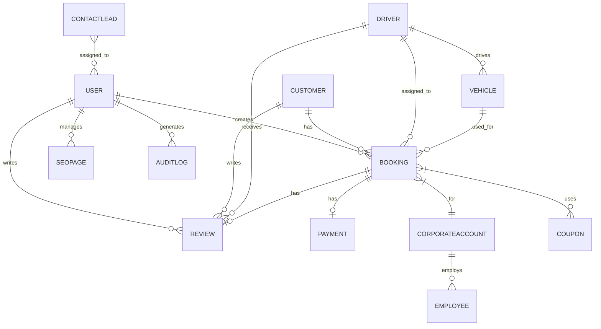
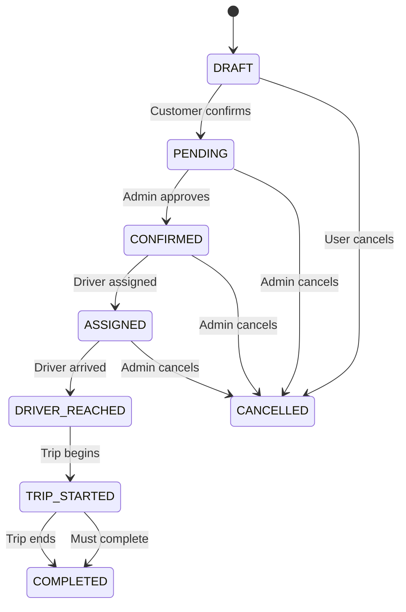
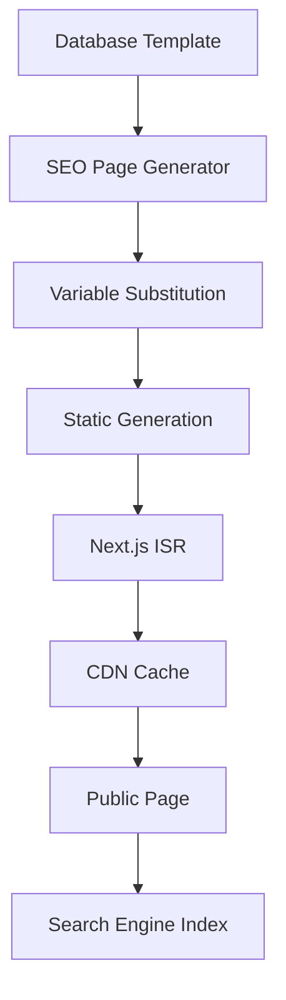
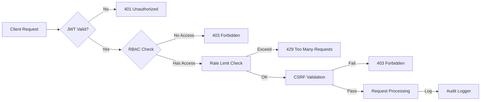
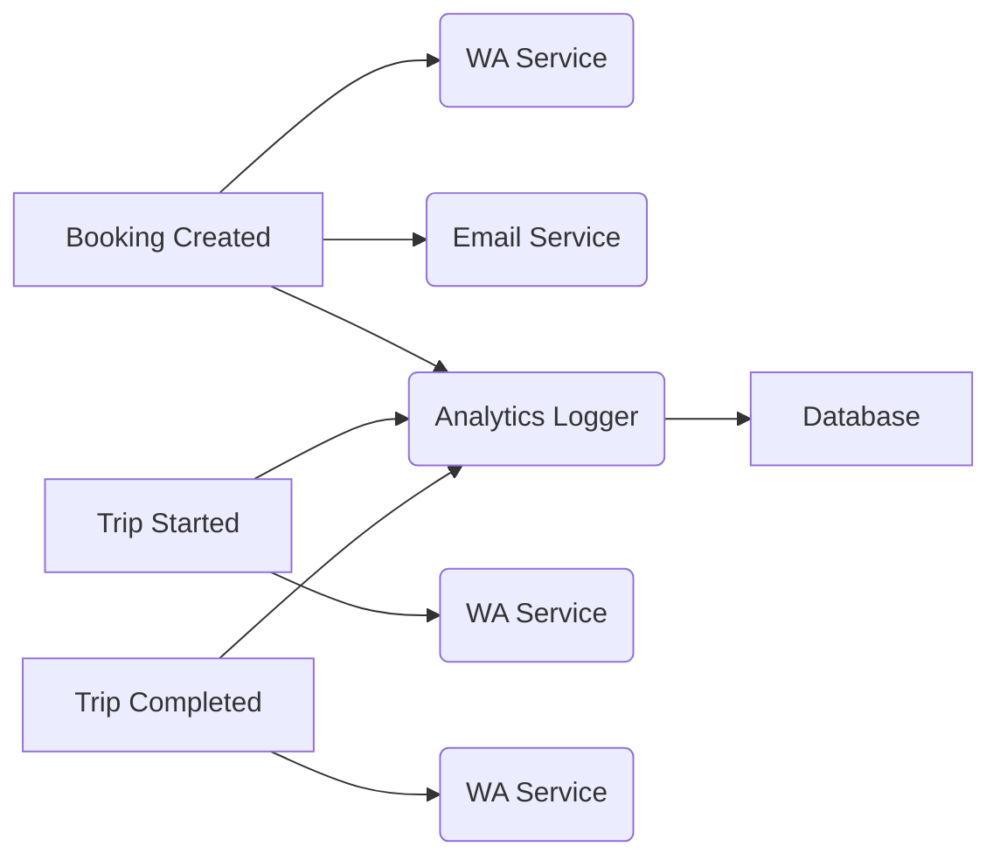

# Phase 2 Enterprise Architecture

## Complete System Architecture

```
┌─────────────────────────────────────────────────────────────────┐
│                    LOAD BALANCER (NGINX)                         │
└─────────────────────────────────────────────────────────────────┘
                                │
        ┌─────────────────────────┼─────────────────────────┐
        ▼                         ▼                         ▼
┌───────────────┐      ┌───────────────┐      ┌───────────────┐
│   Next.js     │      │   Next.js     │      │   Next.js     │
│   App (SSR)   │      │   App (API)   │      │   App (SSR)   │
└───────────────┘      └───────────────┘      └───────────────┘
        │                       │                       │
        └─────────────────────────┼─────────────────────────┘
                                ▼
                    ┌───────────────────────────┐
                    │      PostgreSQL DB         │
                    │    • Users & Auth        │
                    │    • Bookings            │
                    │    • Drivers & Vehicles    │
                    │    • Payments & Coupons    │
                    │    • SEO Pages           │
                    └───────────────────────────┘
                                │
                    ┌───────────────────────────┐
                    │        Redis Cache         │
                    │    • Session Storage       │
                    │    • Rate Limiting         │
                    │    • Queue (BullMQ)        │
                    └───────────────────────────┘
```

## Database ER Diagram



## Booking State Machine



## API Architecture

```
/api/v1/
├── auth/
│   ├── login
│   ├── logout
│   ├── refresh
│   └── me
├── bookings/
│   ├── GET / - list bookings
│   ├── POST / - create booking
│   ├── GET /[id] - get booking
│   ├── PUT /[id]/status - update status
│   └── POST /[id]/assign-driver
├── customers/
│   ├── GET / - list customers
│   ├── POST / - create customer
│   └── GET /[id] - get customer
├── drivers/
│   ├── GET / - list drivers
│   ├── PUT /[id]/status - update status
│   └── PUT /[id]/location - update location
├── vehicles/
│   ├── GET / - list vehicles
│   └── PUT /[id]/status - update status
├── pricing/
│   └── POST /calculate - calculate fare
├── payments/
│   ├── POST /create - create payment
│   └── POST /verify - verify payment
├── analytics/
│   └── GET /dashboard - get metrics
└── seo/
    └── GET /[slug] - get SEO page
```

## Programmatic SEO Flow



## Security Architecture



## Analytics Event Flow



## Deployment Architecture

```
Production Environment:
┌─────────────────────────────────────────────────────────┐
│                  Load Balancer                          │
└─────────────────────────────────────────────────────────┘
                    │
    ┌───────────────┼───────────────┐
    ▼               ▼               ▼
┌──────────┐  ┌──────────┐  ┌──────────┐
│ Web      │  │ Web      │  │ Web      │
│ Server 1 │  │ Server 2 │  │ Server 3 │
└──────────┘  └──────────┘  └──────────┘
    │               │               │
    └───────────────┼───────────────┘
                    ▼
        ┌───────────────────────┐
        │   PostgreSQL DB       │
        │   + Read Replica      │
        └───────────────────────┘
                    │
        ┌───────────────────────┐
        │       Redis Cluster     │
        └───────────────────────┘
```
